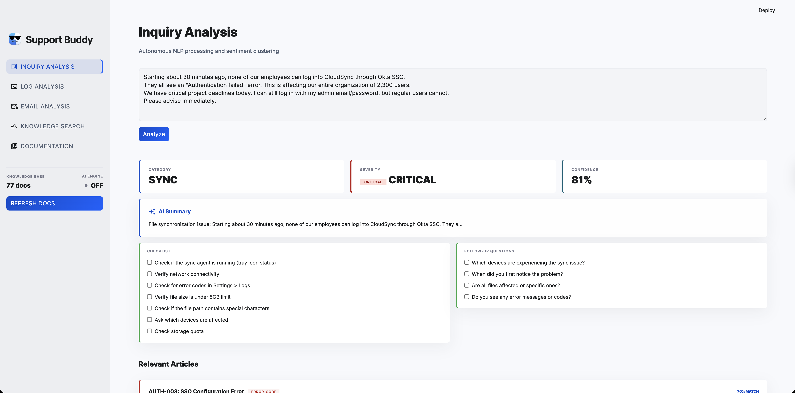
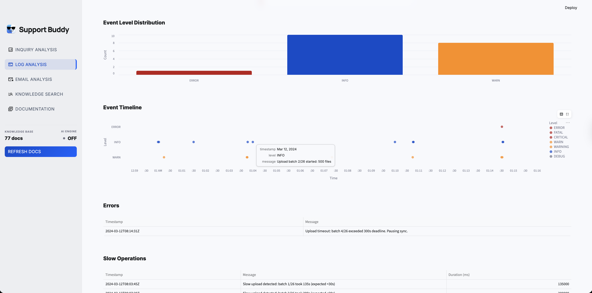
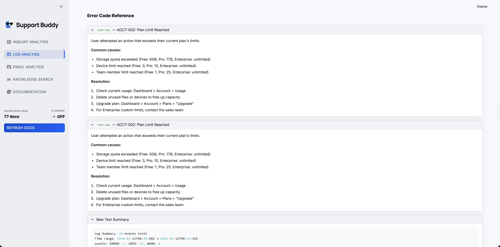
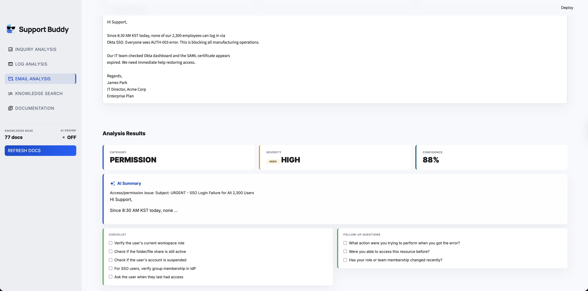
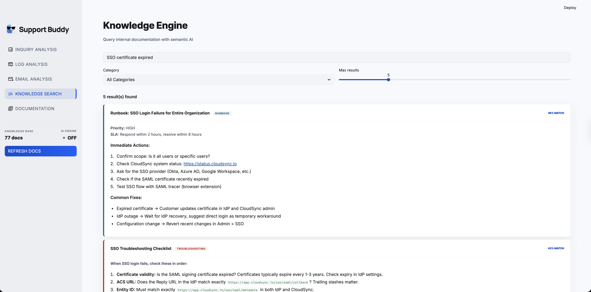
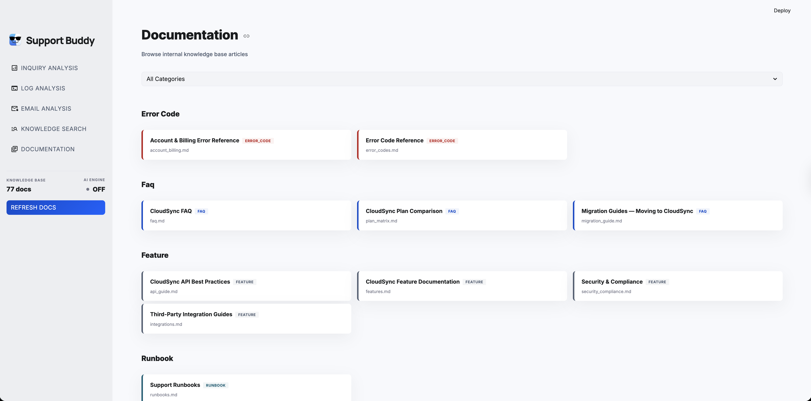
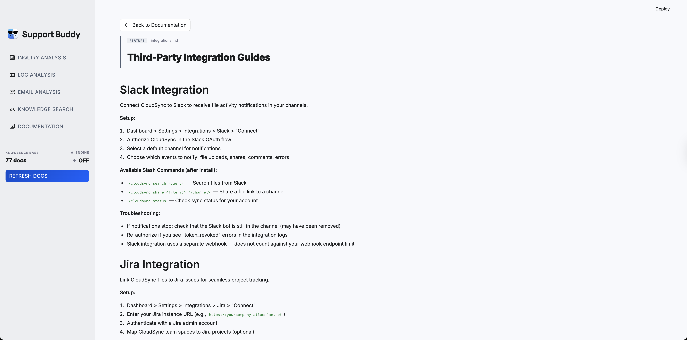

# Support Buddy

AI-powered internal support tool that helps Technical Support Engineers (TSEs) handle customer inquiries faster and more accurately.

Built as a portfolio project demonstrating end-to-end AI application development - from vector-based knowledge retrieval to automated log analysis and intelligent response drafting.

<br/>

## Screenshots

### Inquiry Analysis

Classify customer inquiries by category and severity, with checklist, follow-up questions, and relevant knowledge base articles.



### Log Diagnostics

Parse JSON/text logs, visualize event level distribution and timeline, extract errors and slow operations.





### Email Analysis

Parse raw email content, extract sender metadata, and auto-classify the underlying support issue.



### Knowledge Search

Semantic search over internal documentation with category filtering and relevance scoring.



### Documentation Browser

Browse and read knowledge base articles organized by category.





<br/>

## Features

- **Inquiry Analysis** - Classify customer inquiries by category and severity using keyword matching or Claude AI, with automatic knowledge base article retrieval
- **Log Diagnostics** - Parse JSON/text logs, extract errors and slow operations, visualize event timelines, and generate AI-powered root cause analysis
- **Email Analysis** - Parse raw email content, extract metadata and error codes, and auto-classify the underlying support issue
- **Knowledge Engine** - Semantic search over Markdown-based documentation using ChromaDB vector embeddings with category filtering
- **Documentation Browser** - Browse and read all knowledge base articles with category filtering and full Markdown rendering
- **Response Drafting** - AI-generated customer response drafts with confidence scoring and escalation recommendations

<br/>

## Tech Stack

| Layer | Technology |
|-------|-----------|
| Language | Python 3.11+ |
| AI | Claude API (Anthropic SDK) with tool use |
| Knowledge Store | ChromaDB (vector embeddings) |
| Backend API | FastAPI |
| Frontend | Streamlit |
| Testing | pytest, pytest-asyncio |

<br/>

## Quick Start

### Prerequisites

- Python 3.11+
- [uv](https://docs.astral.sh/uv/) (recommended) or pip

### Setup

```bash
# Clone the repository
git clone https://github.com/yeonsuchoi/support-buddy.git
cd support-buddy

# Install dependencies
uv sync

# Configure environment
cp .env.example .env
# Edit .env and add your ANTHROPIC_API_KEY (optional - keyword mode works without it)
```

### Run the Streamlit UI

```bash
PYTHONPATH=$(pwd) uv run streamlit run src/ui/app.py
```

The app will open at `http://localhost:8501`.

### Run the API server

```bash
uv run uvicorn src.api.main:app --reload
```

API docs available at `http://localhost:8000/docs`.

### Run tests

```bash
uv run pytest tests/ -v
```

<br/>

## Project Structure

```
support-buddy/
├── src/
│   ├── core/
│   │   ├── analyzer/      # Inquiry classification & log parsing
│   │   ├── knowledge/     # Vector store, document loading, search engine
│   │   └── responder/     # AI response drafting
│   ├── integrations/      # Linear, GitHub, Email connectors
│   ├── api/               # FastAPI routes
│   └── ui/                # Streamlit frontend
│       ├── app.py         # Main application (5 pages)
│       ├── docs_browser.py # Documentation browser page
│       ├── styles.py      # Design system CSS & HTML helpers
│       └── static/        # Logo and favicon assets
├── data/
│   ├── knowledge/         # Domain knowledge documents (Markdown)
│   ├── sample_logs/       # Sample log files for testing
│   └── virtual_company/   # Virtual company scenario data
├── tests/
│   ├── unit/
│   ├── integration/
│   └── fixtures/
├── .streamlit/config.toml # Theme configuration
└── pyproject.toml
```

<br/>

## Design System

The UI follows **"The Intelligent Ledger"** design system:

- **Typography**: Manrope (headlines) + Inter (body/data)
- **Color Palette**: Primary `#004bca`, Surface `#f7f9fc`, Error `#ba1a1a`
- **Principles**: No-line rule (tonal layering over borders), glassmorphism for AI insights, editorial spacing

<br/>

## Environment Variables

| Variable | Required | Description |
|----------|----------|-------------|
| `ANTHROPIC_API_KEY` | No | Enables AI-powered analysis (Claude). Without it, keyword-based mode is used. |
| `LINEAR_API_KEY` | No | Linear integration for issue tracking |
| `GITHUB_TOKEN` | No | GitHub integration |

<br/>

## License

This project is licensed under the [MIT License](LICENSE).
